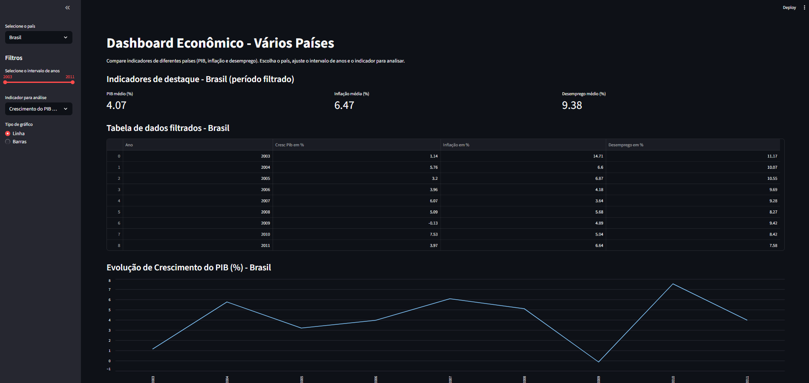

**Dashboard de Crescimento de Países — Análise e Visualização**

- **Tema:** Visualização interativa de indicadores macroeconômicos (PIB, Inflação e Desemprego) para Brasil, Chile, Colômbia e Equador.
- **Justificativa:** A equipe escolheu este tema para comparar padrões de crescimento entre países latino-americanos, praticar limpeza e visualização de séries temporais e construir um painel interativo que facilite a análise comparativa e a discussão em disciplina.

**Fonte dos Dados**

- **Origem dos dados (neste repositório):** arquivos CSV locais: `tabela_brasil.csv`, `tabela_chile.csv`, `tabela_colombia.csv` e `tabela_equador.csv`.
- **Observação sobre a fonte original:** Os CSVs foram preparados a partir de dados públicos (https://api.worldbank.org/v2/country/{codigo_pais}/indicator/{indicador}?date=2003:2011&format=json). Eles foram consumidos e tratados no Colab utilizando Pandas, foi exportado e utilizado para criação do dashboard usando o Streamlit.

**Descrição breve dos dados**

- **Formato:** CSV com observações anuais por país.
- **Colunas usadas pelo `app.py`:** `Ano`, `Cresc Pib em %`, `Inflação em %`, `Desemprego em %`.
- **Escopo temporal:** o intervalo de anos varia por arquivo; o app detecta `min` e `max` automaticamente.

**Perguntas-chave que o dashboard responde**

- **Tendência temporal:** Como evoluiu o indicador selecionado para cada país ao longo do tempo?
- **Comparação entre países:** Quais são as diferenças de crescimento entre Brasil, Chile, Colômbia e Equador no período analisado?
- **Anomalias:** Existem anos com variações atípicas (picos/quedas) que merecem investigação?
- **Resumo estatístico:** Qual a média do período filtrado para PIB, inflação e desemprego?

**Como rodar o projeto localmente**

- **Requisitos mínimos:**
  - Python 3.8+ instalado
  - Internet apenas para instalar dependências (opcional)

- **Instruções (PowerShell no Windows):**

```powershell
# criar e ativar ambiente virtual
python -m venv .venv
.\.venv\Scripts\Activate.ps1

# instalar dependências necessárias
pip install --upgrade pip
pip install streamlit pandas

# executar o app Streamlit
streamlit run app.py
```

- **Observação:** o `app.py` usa `streamlit` e `pandas`. Se você adicionar visualizações com `plotly` ou outras libs, instale-as também.

**Capturas de tela**



  - **Contexto:** Página principal do dashboard que permite selecionar país e intervalo de anos; exibe KPIs resumidos, tabela de dados filtrados e um gráfico de evolução do indicador escolhido.

**Estrutura de arquivos (principal)**

- `app.py`: aplicação Streamlit que gera o dashboard.
- `tabela_brasil.csv`, `tabela_chile.csv`, `tabela_colombia.csv`, `tabela_equador.csv`: dados de entrada usados pelo dashboard.

- **Autoria / Contato:** Equipe do projeto — André Augusto Vendrame, Vinicius de Oliveira Buffalo, Guilherme Alexandre Sardinha, Mauricio Pinheiro Spalla, Matheus Facioli Silva

---